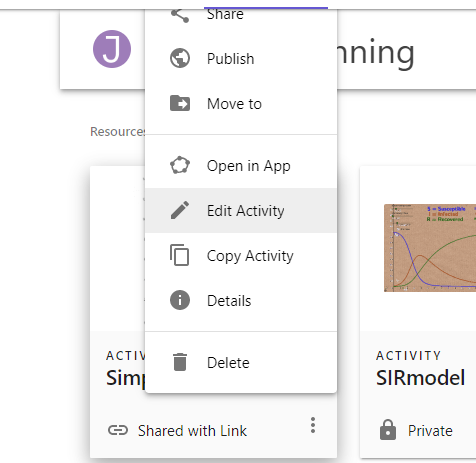

# Geogebra Guide

[Geogebra](https://www.geogebra.org/) is a free interactive math and graphing tool for exploring graphs and models, like a modern graphing calculator.  We use geogebra throughout the course to create and manipulate charts and model simulations. Several interactive questions will use geogebra. 

Geogebra is easy to learn and use, so much so that it is widely used in elementary, middle- and high-school teaching.  

What follows below is a quick guide to creating Geogebra activities.  It's probably not the best first tutorial since a lot of what follows are just notes on on things useful for the course, some of them pretty technical or focused on the aesthetic. 

## Geogebra.org

The main site is at [geogebra.org](https://www.geogebra.org/). If you don't have an account already click the `Sign in` link and use an existing Google, Facebook or other account, or providing an email and password. This will allow you to save and retrieve projects for later reuse. 

There are now different [versions](https://www.geogebra.org/m/vd6UC685#material/shfwqcpr) of geogebra either as online or downloaded apps. We will be using the Classic version available at [geogebra.org/classic](https://www.geogebra.org/classic) 

- Modify n existing app by 
  - either linking directly to its URL if you have one (e.g. this one on [supply and demand](https://www.geogebra.org/m/yhrp4fy4))
  - or going to geogebra.org and then search for classroom resources and search for one you want to modify.
  - In either case once you've opened the resource, click on the snowman (three vertical dots) in the top right corner and choose 'Open in App'
- There are a few ways to get started
  - Go to https://www.geogebra.org/classic to start a new geogebra app. from scratch  
  - - 
- 
-   login from geogebra.org and then click on the icon for your profile in the top right. That takes you to a page where you can  and then click the '+Create' button and choose 'Activity' to start a new project, or go to an existing GB app like this one [on 


- click on axis and choose xAxis positive direction only 
- The `?embed` option seems to not work. 

### Shortcuts

- Ctrl-Shift-a will hide the left Algebra menu (which for diagrams you may want to hide.)


### Different views

- Profile (if logged in) https://www.geogebra.org/u/jonathan.conning
- https://www.geogebra.org/classic/yhrp4fy4


## Show on condition

advanced settings. Condition to show (e.g. a>0)


## Lines and Segments

- From Tools choose Segment or Lines
- Segment put a point on X axis and a point on Y axis, from then on will stick to those axes.
  - under settings uncheck 'Show label'


### Settings

Click on Gear

- Zoom to fit
- click the gear, show grid, major grid lines.


### Axes

-  Right click on axes and settings. got to xAxis and choose 'Positive Direction Only'
- 

### Grid

- if choose 
- From Basic tab you can Lock the min and max.  Set say -0.5 to 10 and then also under xAxis choose 'positive direction only'


Qe=(x(E),0)


## Tables

### Resizing Embed

- Once you've saved your GB activity you'll want to change settings on how it will be displayed inside an iframe embed.  For this you'll need to go back to your profile where you will see all your past saved or visited activities.  
- Click on the snowman to edit the activity you want. Like this:



- Now hover over the displayed activity and click on the edit pencil 
- scroll down and click advance settings.  
- Here you can adjust width and height and 'edit the applet' button.  Inside that you can adjust width and heights by selecting and dragging the edges. .
- You can then click on share button to get very complete iframe html which will size things right. 


<iframe scrolling="no" title="Simple Diagrams" s

rc="https://www.geogebra.org/material/iframe/id/yhrp4fy4/width/1000/height/657/border/888888/sfsb/true/smb/false/stb/false/stbh/false/ai/false/asb/false/sri/true/rc/false/ld/false/sdz/true/ctl/false" width="1000px" height="657px" style="border:0px;"> </iframe>


# With the `?embed` code

This is normal size text

<iframe src="https://www.geogebra.org/classic/z48jempr?embed" width="80" height="400" style="border: 1px solid #e4e4e4;border-radius: 4px;" frameborder="0"></iframe>


# Without the ?embed`code

But notice the large size of the box.

<iframe src="https://www.geogebra.org/classic/z48jempr" width="800" height="500" style="border: 1px solid #e4e4e4;border-radius: 4px;" frameborder="0"></iframe>


A

```html
<iframe src="https://www.geogebra.org/m/Qqe5yTJ5" width="800" height="400" allowfullscreen style="border: 1px solid #e4e4e4;border-radius: 4px;" frameborder="0"></iframe>
```


<iframe src="https://www.geogebra.org/m/Qqe5yTJ5"></iframe>


<iframe src="https://www.geogebra.org/m/Qqe5yTJ5" width="800" height="400" allowfullscreen style="border: 1px solid #e4e4e4;border-radius: 4px;" frameborder="0"></iframe>


### 